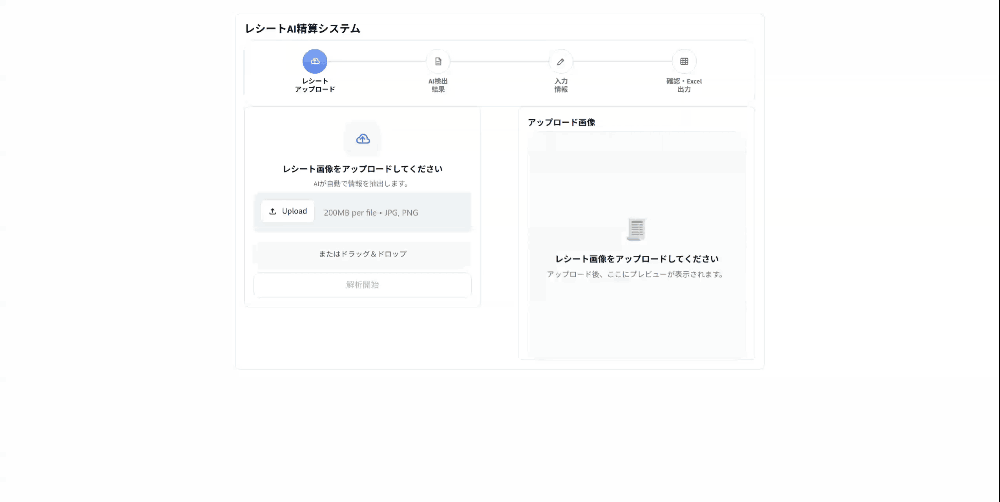

# レシートAI精算システム

YOLO11n と EasyOCR を組み合わせ、日本語レシートの経費データ化を支援する MVP です。

日本の中小企業で経費精算を担当する会計スタッフを主な対象とし、レシートから日付・電話番号・最終支払金額を読み取ることで、手入力作業と入力ミスの削減を目指します。完全な会計システムではなく、AI の結果をユーザーが確認・補完してから Excel に出力する支援ツールです。

## Demo

<p align="center">
  
  <br>
  <em>Streamlit デモ</em>
</p>

> [!NOTE]
> Application: 未公開（ローカル実行のみ）

## Features

- YOLO11n による `date`・`phone`・`total` の領域検出
- YOLO bbox を利用した ROI ベースの OCR
- EasyOCR による日本語・英語・数字の認識
- OCR 候補からの最終支払金額の抽出と正規化
- Streamlit による確認・手入力ワークフロー
- 確認済みデータの Excel 出力とダウンロード

---

## システム構成

```text
Receipt Image
    ↓
YOLO11n
    ↓
date / phone / total Detection
    ↓
ROI Crop
    ↓
EasyOCR（ja + en）
    ↓
Date / Phone Normalization
Amount Parser
    ↓
Streamlit Confirmation
    ↓
Merchant Input / Tax Rate Selection
    ↓
Excel Export
```

YOLO11n はフィールド位置の検出だけを担当し、文字認識は行いません。EasyOCR は YOLO が検出した ROI 内の文字を認識し、Amount Parser は `total` 領域の OCR 結果から最終支払金額を抽出します。

開発と実行環境の役割は次のように分離しています。

| 環境 | 役割 |
|---|---|
| ローカル環境 | アプリケーション開発、YOLO 推論、OCR、Streamlit、Excel 出力 |
| Kaggle | GPU を使用した YOLO 学習記録と deployment evaluation |

正式なローカル推論モデルは `models/best.pt` です。Kaggle セッション内の一時的な学習出力パスは、ローカルのデプロイパスとして使用しません。

---

## データセット作成

現在確認されているデータセット情報は次のとおりです。

| 項目 | 内容 |
|---|---|
| データ | 自己収集した日本語レシート |
| 画像数 | 125 枚 |
| 画像単位 | 1 画像につき 1 レシート |
| Roboflow version | 3 |
| Train | 100 枚 |
| Validation | 12 枚 |
| Test | 13 枚 |
| クラス数 | 3 |
| クラス順序 | `date`, `phone`, `total` |
| データセット記載ライセンス | CC BY 4.0 |

対象レシートには、飲食店、スーパーマーケット、ドラッグストア、100 円ショップ、小売店が含まれます。

## YOLOモデル学習

YOLO11n の学習は Kaggle GPU 環境で実施し、学習記録は次の notebook に保存しています。

```text
docs/260810-receipts_detection_yolo11n_training.ipynb
```

主な学習設定:

| 項目 | 設定 |
|---|---:|
| Base model | `yolo11n.pt` |
| Training image size | 640 |
| Epochs | 300 |
| Batch size | 8 |
| Patience | 80 |
| Mosaic | 0.2 |
| Translation | 0.05 |
| Scale | 0.2 |
| Horizontal flip | 0.0 |
| Vertical flip | 0.0 |
| Seed | 42 |

保存された学習記録では、292 epoch で early stopping が実行され、best epoch は 212 です。

### YOLO Training Validation Metrics

この指標は、モデル開発中に `validation` split を使用して確認した学習性能です。正式な deployment test evaluation の結果ではありません。

評価条件:

- Split: `validation`
- Image size: `640`

| 指標 | 値 |
|---|---:|
| Precision | 0.980 |
| Recall | 0.957 |
| mAP50 | 0.991 |
| mAP50-95 | 0.703 |

## Deployment Evaluation

この指標は、正式な `models/best.pt` を Kaggle Dataset としてマウントし、現在のデプロイ条件で `test` split を評価した結果です。前節の training validation metrics とは、データ split と評価設定が異なります。

評価条件:

- Environment: Kaggle
- Split: `test`
- Image size: `1024`
- Confidence threshold: `0.5`

### Overall Metrics

| 指標 | 値 |
|---|---:|
| Precision | 0.953 |
| Recall | 0.944 |
| mAP50 | 0.962 |
| mAP50-95 | 0.709 |

### Per-class Metrics

| Class | Precision | Recall | mAP50 | mAP50-95 |
|---|---:|---:|---:|---:|
| date | 0.899 | 0.917 | 0.901 | 0.698 |
| phone | 0.989 | 1.000 | 0.995 | 0.736 |
| total | 0.973 | 0.917 | 0.989 | 0.693 |

評価に使用した `best.pt` の SHA256:

```text
f8a443ac6654a9dfcff0863f3177139175a6bbefd0e9955c12220e9dd5cef369
```

Evaluation artifact:

```text
docs/evaluation_results/test_1024_conf_0_5_evaluation_artifacts.zip
```

---

## OCR処理

レシート全体には、商品価格、税額、小計、時刻など多数の数字が含まれます。画像全体を OCR すると、対象フィールドの近くにある不要な数字や文字が認識結果へ混入しやすくなります。

そのため、本システムではレシート全体を主要な OCR 入力として使用せず、YOLO が検出した `date`、`phone`、`total` の ROI だけを EasyOCR で処理します。

- OCR engine: EasyOCR
- Languages: `ja`, `en`
- Input: 画像パス、PIL Image、NumPy array
- Bbox format: `[x1, y1, x2, y2]`
- 通常 ROI padding ratio: `0.05`

OCR の共通出力形式:

```python
[
    {
        "text": "¥2706",
        "confidence": 0.95,
        "bbox": [x1, y1, x2, y2]
    }
]
```

`total` 領域では、小さい数字やカンマの認識を改善するため、base ROI と wide ROI、3 倍拡大を含む複数の OCR 試行を使用します。

---

## 金額処理

`extraction/amount_parser.py` は、`total` ROI から得られた OCR 候補を正規化し、最終支払金額を抽出します。

対応例:

- `¥2706`
- `¥2,706`
- `2,706`
- `2706`

金額は、計算用の整数値と表示用文字列に分けて保持します。

```text
amount_value   = 2706
amount_display = "¥2706"
```

- `amount_value`: 税額計算に使用
- `amount_display`: Streamlit と Excel の表示に使用

---

## Streamlit Application

アプリケーション名は「レシートAI精算システム」です。

1. **レシートアップロード**
   レシート画像を選択し、「解析開始」を押します。
2. **AI 検出結果**
   日付、電話番号、合計金額を読み取り専用で確認します。
3. **入力情報**
   店舗名を入力し、税率 `8%` または `10%` を選択します。
4. **確認・Excel 出力**
   最終データを表で確認してから Excel を出力・ダウンロードします。

店舗名は自動抽出せず、ユーザーが入力します。消費税額は、検出した合計金額が税込であることを前提に、次の式で計算します。

```text
tax = total_amount * tax_rate / (100 + tax_rate)
```

現在の UI は、1 回のワークフローで 1 枚のレシートを処理します。

### Excel 出力

出力列:

| 列 | 内容 |
|---|---|
| ID | レコード ID |
| Date | 日付 |
| Phone | 電話番号 |
| Merchant | ユーザーが入力した店舗名 |
| Amount | `¥{integer}` 形式の合計金額 |
| Tax | 計算された消費税額 |
| Image_Path | 処理した画像のパス |

既定の出力先:

```text
output/excel/receipt_results.xlsx
```

出力先の Excel ファイルが使用中の場合は、上書きエラーを避けるため別名で保存します。

---

## モデル選択理由

### YOLO11n

- 軽量でローカル推論に組み込みやすい
- 推論速度が速く、確認 UI と組み合わせやすい
- `date`、`phone`、`total` の 3 フィールド検出という現在の用途に適している
- Ultralytics の公式 API で学習と推論の設定を管理できる

### EasyOCR

- Python パイプラインへ統合しやすい
- 日本語と英語を同時に扱える
- 画像ファイルだけでなく PIL Image と NumPy array の ROI を直接処理できる
- YOLO で切り出した小さな領域の文字認識に利用できる

---

## 課題と解決方法

| 課題 | 対応 |
|---|---|
| 小さい文字領域の検出 | 学習時は `imgsz=640` を使用し、正式なローカル推論では `imgsz=1024` を使用する |
| レシート全体 OCR によるノイズ | YOLO bbox から `date`、`phone`、`total` の ROI を切り出し、対象領域だけを OCR する |
| 合計金額の認識エラー | `total` ROI の相対 padding、wide ROI、3 倍拡大、複数 OCR 試行、Amount Parser の正規化を使用する |
| 学習環境と実行環境の混同 | Kaggle は学習記録と evaluation、ローカルはアプリケーション実行に分離し、推論設定を `deploy_config.json` に集約する |

---

## セットアップ

### 動作環境

- OS: Windows
- Python: 3.10

### 依存パッケージのインストール

プロジェクトルートで実行します。

```powershell
python -m pip install -r requirements.txt
```

### Streamlit の起動

`models/best.pt` が配置されていることを確認し、プロジェクトルートで実行します。

```powershell
streamlit run app/streamlit_app.py
```

正式なローカル推論設定:

```json
{
  "model_path": "models/best.pt",
  "imgsz": 1024,
  "conf_threshold": 0.5,
  "classes": {
    "0": "date",
    "1": "phone",
    "2": "total"
  }
}
```

---

## 主要ファイル

| ファイル | 責務 |
|---|---|
| `deploy_config.json` | モデルパス、推論画像サイズ、confidence threshold、クラス対応の管理 |
| `models/best.pt` | 正式なローカル推論モデル |
| `detection/yolo_detector.py` | YOLO モデルの読み込み、推論、検出結果と注釈画像の生成 |
| `ocr/easyocr_service.py` | EasyOCR の初期化と OCR 結果の共通形式への変換 |
| `extraction/amount_parser.py` | total ROI の OCR 候補から最終支払金額を抽出 |
| `app/receipt_pipeline.py` | YOLO、ROI crop、OCR、解析処理の統合 |
| `app/streamlit_app.py` | 画像アップロード、結果表示、手入力、確認、Excel 出力操作 |
| `utils/excel_export.py` | 確認済みレシート情報の Excel 出力 |

---

## 現在の制限

- データセットは 125 枚に限定されています。
- 未知の店舗やレシート形式に対する一般化性能は未確認です。
- 店舗名は自動抽出しません。
- 税率と税額は OCR から自動抽出しません。
- Streamlit は一度に 1 枚のレシートを処理します。
- 日付、電話番号、合計金額は現在の UI では読み取り専用です。
- UI は低 confidence の検出結果を個別に警告しません。
- `requirements.txt` の依存バージョンは固定されていません。
- 自動化された Streamlit end-to-end テストはありません。

---

## Future Work

- レシートテンプレートの追加
- 画像前処理の改善
- 店舗名の自動抽出
- 税情報の自動抽出
- 経費カテゴリの自動分類
- データベース連携
- LLM を利用した情報抽出
- OCR エンジンの精度と速度の比較
