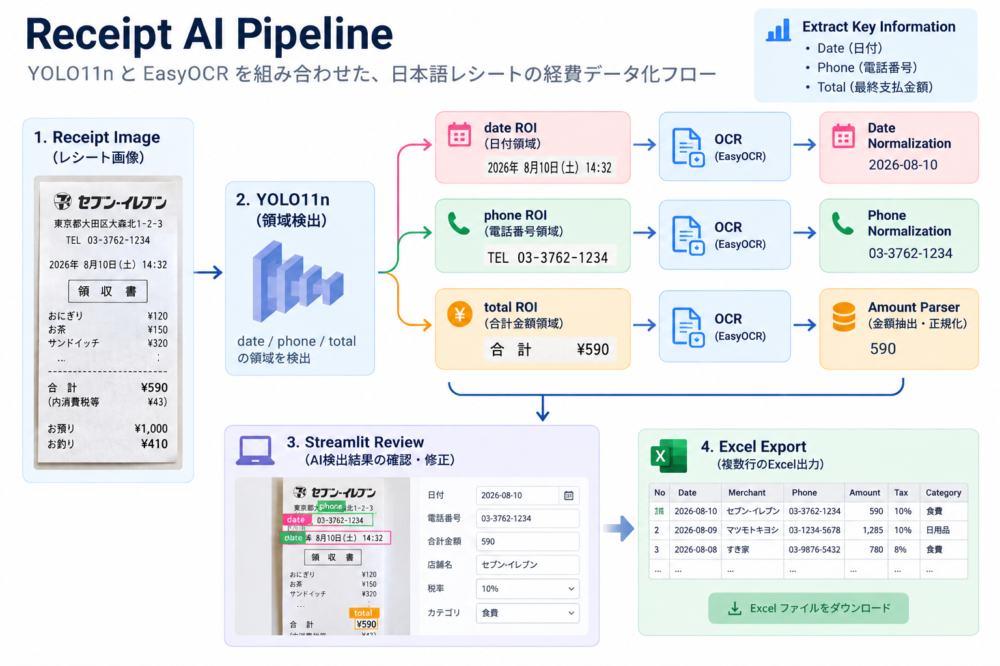

# レシートAI精算システム

## プロジェクト概要

YOLO11n と EasyOCR を組み合わせ、日本語レシートの経費データ化を支援する MVP です。

日本の中小企業で経費精算を担当する会計スタッフを主な対象とし、レシートから日付・電話番号・最終支払金額を読み取ります。完全な会計システムではなく、AI の結果をユーザーが確認・補完してから Excel に出力する支援ツールです。

## デモ

<p align="center">
  
  <br>
  <em>Streamlit デモ</em>
</p>

> [!NOTE]
> Application: [https://receipt-detection-system-publiclink.streamlit.app/](https://receipt-detection-system-publiclink.streamlit.app/)

## プロジェクトハイライト

- 自作データセット：日本語レシート画像 125 枚
- 物体検出：YOLO11n による `date`・`phone`・`total` の領域検出
- OCR：EasyOCR を用いた ROI ベースの文字認識
- 独立テスト：mAP50 = 0.9686 / mAP50-95 = 0.6240
- Human-in-the-loop：Streamlit 上で AI の検出結果を確認・修正
- Excel 出力：確認済みデータを構造化して複数行で出力

## システム構成

<p align="center">
  
</p>

YOLO11n はフィールド位置を検出し、文字認識は行いません。検出した `date`、`phone`、`total` の ROI を EasyOCR へ渡し、日付と電話番号は表記を正規化し、合計金額は Amount Parser で最終支払金額を選択します。

Streamlit では複数のレシートをアップロード順に処理します。確認済みの抽出値・店舗・税情報はレシート単位で保持し、最終確認画面と Excel 出力で使用します。

### 主要ファイル

| ファイル | 責務 |
|---|---|
| `deploy_config.json` | モデルパス、推論画像サイズ、confidence threshold、クラス対応の管理 |
| `models/best.pt` | アプリケーションで使用する YOLO11n モデル |
| `detection/yolo_detector.py` | YOLO 推論、検出結果と注釈画像の生成 |
| `ocr/easyocr_service.py` | EasyOCR の初期化と OCR 結果の共通形式への変換 |
| `extraction/amount_parser.py` | total ROI の OCR 候補から最終支払金額を抽出 |
| `app/receipt_pipeline.py` | YOLO、ROI crop、OCR、解析処理の統合 |
| `app/streamlit_app.py` | アップロード、結果表示、手入力、確認、Excel 出力操作 |
| `utils/excel_export.py` | 確認済みレシート情報の Excel 出力 |

## データセット

日本国内で収集した日本語レシート画像を用いて作成した自作データセットです。

| 項目 | 内容 |
|---|---|
| 画像数 | 125 枚 |
| 画像単位 | 1 画像につき 1 レシート |
| Roboflow version | 4 |
| Train | 100 枚（80.0%） |
| Validation | 12 枚（9.6%） |
| Test | 13 枚（10.4%） |
| Roboflow export resolution | 1024 × 1024（アスペクト比を維持して padding） |
| アノテーション数 | date: 125、phone: 125、total: 122 |
| クラス数・順序 | 3（`date`, `phone`, `total`） |

対象には、飲食店、スーパーマーケット、ドラッグストア、100 円ショップ、小売店のレシートが含まれます。データセットは Train 100 枚、Validation 12 枚、Test 13 枚に分割しています。

対象を `date`・`phone`・`total` の 3 領域に限定し、事前学習済み YOLO11n をベースに学習しています。現在のデータセットは小規模であるため、今後は店舗・レイアウト単位での分割をより明確に管理し、未知店舗を含む評価データを拡充する予定です。

## モデル学習・評価

学習・評価ワークフローは次の notebook に記録し、正式な評価結果は `docs/evaluation_results/` に保存しています。

```text
docs/260906-yolo11n-training-notebook-1024.ipynb
```

### 学習設定

| 項目 | 設定 |
|---|---:|
| Base model | `yolo11n.pt` |
| Training image size | 1024 |
| Epochs / Batch size / Patience | 300 / 8 / 80 |
| Mosaic | 0.2 |
| Mixup / Cutmix | 0.0 / 0.0 |
| Degrees / Shear / Perspective | 0.0 / 0.0 / 0.0 |
| Translation / Scale | 0.05 / 0.2 |
| Horizontal / Vertical flip | 0.0 / 0.0 |
| Seed | 42 |

学習記録は `docs/training_results/yolo11n_1024/` に保存しています。245 epoch で early stopping が実行され、best epoch は 165 です。アプリケーション推論設定は `deploy_config.json` で定義し、`imgsz=1024`、`conf_threshold=0.5` を使用します。

### Validation 指標

学習終了後に `validation` split で確認した結果であり、独立 test benchmark とは区別します。

- Images / Instances: `12 / 36`
- Image size: `1024`

| 指標 | 値 |
|---|---:|
| Precision | 0.993 |
| Recall | 1.000 |
| mAP50 | 0.995 |
| mAP50-95 | 0.731 |

<p align="center">
  
</p>

学習初期に各 loss が大きく低下し、その後安定して収束しています。validation 側の loss も大きく発散しておらず、少なくとも本 split 上では明確な学習崩壊は確認されませんでした。

### Formal Test Benchmark

正式な `models/best.pt` を独立した `test` split で評価した結果です。

- Images / Instances: `13 / 38`
- Image size: `1024`
- Confidence: Ultralytics validation default（benchmark 評価では `conf` を指定しない）

| 指標 | 値 |
|---|---:|
| Precision | 0.9411 |
| Recall | 0.9496 |
| mAP50 | 0.9686 |
| mAP50-95 | 0.6240 |

保存済み benchmark ログには overall 指標のみが出力されています。Precision-Recall 曲線からクラス別 AP@0.5 は確認できますが、各クラスの Precision、Recall、mAP50-95 をそろえた原始出力は保存されていないため、完全な per-class metrics 表は掲載していません。

mAP50 と mAP50-95 の差から、より厳しい IoU 条件では Bounding Box の位置精度に改善余地があります。

#### F1-Confidence Curve

<p align="center">
  
</p>

本 test split では、overall F1 は confidence ≈ 0.617 付近で最大となっています。

## OCR・金額処理

レシート全体には商品価格、税額、小計、時刻など多数の数字が含まれるため、YOLO が検出した `date`、`phone`、`total` の ROI だけを EasyOCR で処理します。

- OCR engine: EasyOCR
- Languages: `ja`, `en`
- Input: 画像パス、PIL Image、NumPy array
- Bbox format: `[x1, y1, x2, y2]`
- 通常 ROI padding ratio: `0.05`

OCR の共通出力形式:

```python
[
    {
        "text": "¥2706",
        "confidence": 0.95,
        "bbox": [x1, y1, x2, y2]
    }
]
```

日付と電話番号は、OCR で混同しやすい文字を補正した後、複数の表記形式を正規化します。

`total` では base ROI と wide ROI、3 倍拡大を含む複数の OCR 試行を使用します。Amount Parser は OCR confidence、位置、桁数、通貨記号、合計を示す語、税額・小計を示す除外語を用いて候補を評価します。

対応例: `¥2706`、`¥2,706`、`2,706`、`2706`

```text
amount_value   = 2706
amount_display = "¥2706"
```

- `amount_value`: 税額計算に使用
- `amount_display`: Streamlit と Excel の表示に使用

## 技術的な判断・課題と解決方法

| 課題・判断 | 対応 |
|---|---|
| 小さい文字領域の検出 | データセットを 1024 × 1024 で出力し、学習・推論ともに `imgsz=1024` を使用する |
| レシート全体 OCR によるノイズ | YOLO bbox から 3 領域の ROI を切り出し、対象領域だけを OCR する |
| 合計金額の文字切れと OCR 認識エラー | 相対 padding、wide ROI、3 倍拡大、複数 OCR 試行を使用する |
| 小計・税額を含む複数の金額候補 | Amount Parser で confidence、位置、桁数、通貨記号、合計語・除外語を評価する |
| 日付・電話番号の文字混同と表記揺れ | OCR で混同しやすい文字を補正し、ルールベースで正規化する |
| 複数レシートでデータが混在するリスク | レシートごとに固有 ID と状態を持たせ、画像・抽出値・修正値・税情報の対応を維持する |
| Benchmark 上の最適 F1 threshold と実運用に適した threshold の差 | Benchmark では confidence ≈ 0.617 で overall F1 が最大となる一方、YOLO 段階では recall を重視し、有効候補を後段の OCR・Amount Parser に残すため、deployment では `conf_threshold=0.5` を採用する |

## アプリケーション

1. **レシートアップロード**：複数画像を選択し、アップロード順に処理します。
2. **AI 検出結果**：検出画像を確認し、日付・電話番号・合計金額を修正できます。
3. **入力情報**：元画像を参照し、店舗名と税率 `8%` または `10%` を入力します。
4. **確認・Excel 出力**：最終データを確認し、アップロード順の複数行として出力します。

修正した抽出値と入力した店舗・税情報はレシートごとに保持され、Page 4 と Excel には確認済みの値を使用します。前の画面へ戻った場合も編集値を保持します。

消費税額は、合計金額が税込であることを前提に次の式で計算します。

```text
tax = total_amount * tax_rate / (100 + tax_rate)
```

### Excel 出力

| 列 | 内容 |
|---|---|
| ID | レコード ID |
| Date | 日付 |
| Phone | 電話番号 |
| Merchant | ユーザーが入力した店舗名 |
| Amount | `¥{integer}` 形式の合計金額 |
| Tax | 計算された消費税額 |
| Image_Path | 処理した画像のパス |

既定の出力先は `output/excel/receipt_results.xlsx` です。ファイルが使用中の場合は、上書きエラーを避けるため別名で保存します。

### 採用技術

- **YOLO11n**：軽量で推論が速く、3 フィールドの検出と確認 UI の組み合わせに適しています。
- **EasyOCR**：日本語と英語を同時に扱え、PIL Image と NumPy array の ROI を直接処理できます。

## セットアップ

### 実行要件

- Python 3.10

```powershell
python -m pip install -r requirements.txt
streamlit run app/streamlit_app.py
```

`models/best.pt` が配置されていることを確認して実行します。アプリケーション推論設定:

```json
{
  "model_path": "models/best.pt",
  "imgsz": 1024,
  "conf_threshold": 0.5,
  "classes": {
    "0": "date",
    "1": "phone",
    "2": "total"
  }
}
```

## 現在の制限

- test split は 13 枚と小規模であり、未知店舗・異なるレイアウトに対する汎化性能の検証は限定的です。
- test split の mAP50 は 0.9686、mAP50-95 は 0.6240 であり、厳しい IoU 条件では Bounding Box の位置精度に改善余地があります。
- 類似した日付・電話番号・金額文字列による Background False Positive が一部確認されています。
- 店舗名・税率・税額は OCR から自動抽出していません。
- UI は低 confidence の検出結果を個別に警告しません。
- 自動化された Streamlit end-to-end テストはありません。

## 今後の改善

| 現在の制限・評価結果 | 改善方針 |
|---|---|
| 小規模 test split では一般化性能を十分に評価できない | 未知店舗・異なるレイアウトを含む test dataset を拡大する |
| 類似する背景文字列で False Positive が発生する | 非対象領域を Hard Negative として追加する |
| mAP50 と mAP50-95 に差があり、`total` では文字切れ・OCR 誤認識が残る | `total` のアノテーションと Bounding Box を再確認し、検出位置と OCR 精度を改善する |
| 店舗名と税情報がユーザー入力に依存する | Merchant / Tax 情報の自動抽出を検討する |
