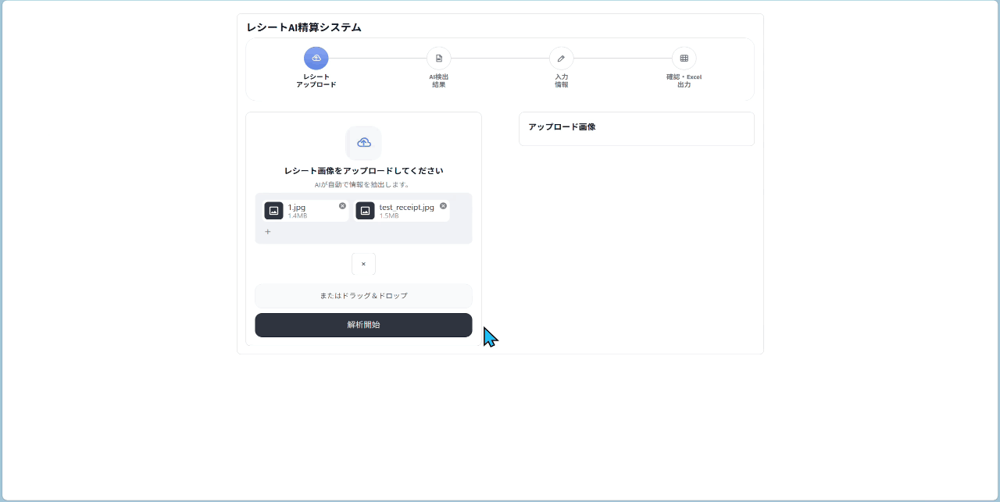
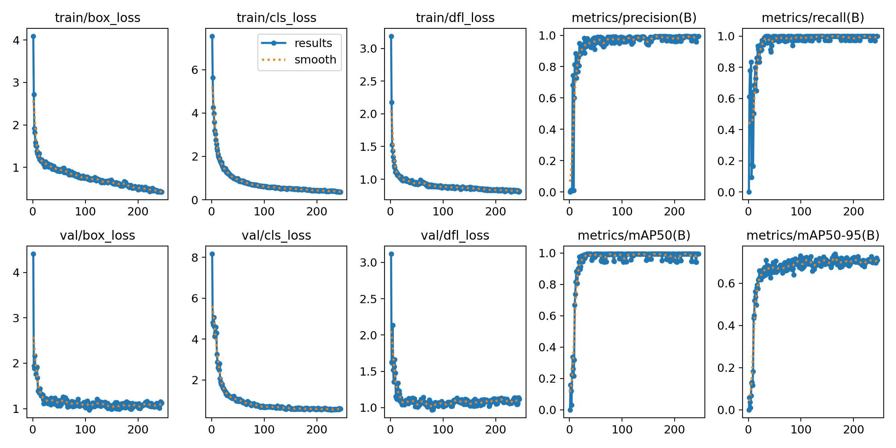
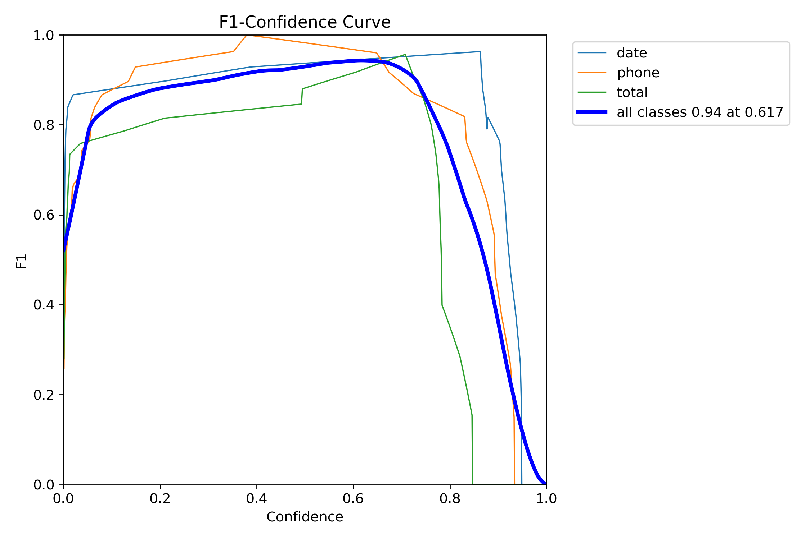

# レシートAI精算システム

YOLO11n と EasyOCR を組み合わせ、日本語レシートの経費データ化を支援する MVP です。

日本の中小企業で経費精算を担当する会計スタッフを主な対象とし、レシートから日付・電話番号・最終支払金額を読み取ることで、手入力作業と入力ミスの削減を目指します。完全な会計システムではなく、AI の結果をユーザーが確認・補完してから Excel に出力する支援ツールです。

## Demo

<p align="center">
  
  <br>
  <em>Streamlit デモ</em>
</p>

> [!NOTE]
> Application: [https://receipt-detection-system-publiclink.streamlit.app/](https://receipt-detection-system-publiclink.streamlit.app/)

## Features

- YOLO11n による `date`・`phone`・`total` の領域検出
- YOLO bbox を利用した ROI ベースの OCR
- EasyOCR による日本語・英語・数字の認識
- OCR 候補からの最終支払金額の抽出と正規化
- Streamlit による複数レシートのアップロード・順次処理
- 日付・電話番号・合計金額を手動修正できる AI 検出結果の確認
- 確認済みレシートの複数行 Excel 出力とダウンロード

---

## システム構成

```text
Receipt Image
    ↓
YOLO11n
    ↓
date / phone / total Detection
    ↓
ROI Crop
    ↓
EasyOCR（ja + en）
    ↓
Date / Phone Normalization
Amount Parser
    ↓
Streamlit Confirmation
    ↓
Merchant Input / Tax Rate Selection
    ↓
Excel Export
```

YOLO11n はフィールド位置の検出だけを担当し、文字認識は行いません。EasyOCR は YOLO が検出した ROI 内の文字を認識し、Amount Parser は `total` 領域の OCR 結果から最終支払金額を抽出します。

開発と実行環境の役割は次のように分離しています。

| 環境 | 役割 |
|---|---|
| ローカル環境 | アプリケーション開発、YOLO 推論、OCR、Streamlit、Excel 出力 |
| Kaggle | GPU を使用した YOLO 学習と独立した test benchmark |

正式なローカル推論モデルは `models/best.pt` です。Kaggle セッション内の一時的な学習出力パスは、ローカルのデプロイパスとして使用しません。

---

## データセット作成

現在確認されているデータセット情報は次のとおりです。

| 項目 | 内容 |
|---|---|
| 画像数 | 125 枚 |
| 画像単位 | 1 画像につき 1 レシート |
| Roboflow version | 4 |
| Train | 100 枚 |
| Validation | 12 枚 |
| Test | 13 枚 |
| Roboflow export resolution | 1024 × 1024（アスペクト比を維持して padding） |
| アノテーション数 | date: 125、phone: 125、total: 122 |
| クラス数 | 3 |
| クラス順序 | `date`, `phone`, `total` |
| データセット | 自作データセット（日本国内で収集したレシート画像） |

対象レシートには、飲食店、スーパーマーケット、ドラッグストア、100 円ショップ、小売店が含まれます。

## YOLOモデル学習

YOLO11n の学習は Kaggle GPU 環境で実施しています。次の notebook には学習・評価ワークフローを記録し、正式な評価結果は `docs/evaluation_results/` に別途保存しています。

```text
docs/260906-yolo11n-training-notebook-1024.ipynb
```

主な学習設定:

| 項目 | 設定 |
|---|---:|
| Base model | `yolo11n.pt` |
| Training image size | 1024 |
| Epochs | 300 |
| Batch size | 8 |
| Patience | 80 |
| Mosaic | 0.2 |
| Mixup / Cutmix | 0.0 / 0.0 |
| Degrees / Shear / Perspective | 0.0 / 0.0 / 0.0 |
| Translation | 0.05 |
| Scale | 0.2 |
| Horizontal flip | 0.0 |
| Vertical flip | 0.0 |
| Seed | 42 |

現在の正式モデルの学習記録は `docs/training_results/yolo11n_1024/` に保存しています。現在のデプロイ設定は `deploy_config.json` で定義し、`imgsz=1024`、`conf_threshold=0.5` を使用します。

保存された学習記録では、245 epoch で early stopping が実行され、best epoch は 165 です。

### YOLO Training Validation Metrics

この指標は、正式モデルの学習終了後に `validation` split で確認した結果です。独立した test benchmark とは区別します。

評価条件:

- Split: `validation`
- Images / Instances: `12 / 36`
- Image size: `1024`

| 指標 | 値 |
|---|---:|
| Precision | 0.993 |
| Recall | 1.000 |
| mAP50 | 0.995 |
| mAP50-95 | 0.731 |

## Training Curves

学習中の train / validation loss、および Precision、Recall、mAP の推移を示します。

<p align="center">
  
</p>

この結果から、学習初期に各 loss が大きく低下し、その後安定して収束していることが確認できます。  
また、validation 側の loss も大きく発散しておらず、少なくとも本 validation split 上では明確な学習崩壊は確認されませんでした。

## Formal Test Benchmark

正式な `models/best.pt` のモデル性能を、独立した `test` split で評価した結果です。

評価条件:

- Environment: Kaggle
- Split: `test`
- Images / Instances: `13 / 38`
- Image size: `1024`
- Confidence: Ultralytics validation default（benchmark 評価では `conf` を指定しない）

### Overall Metrics

| 指標 | 値 |
|---|---:|
| Precision | 0.9411 |
| Recall | 0.9496 |
| mAP50 | 0.9686 |
| mAP50-95 | 0.6240 |

### Deployment Configuration

アプリケーションでは `deploy_config.json` に従い、`imgsz=1024`、`conf_threshold=0.5` で低 confidence の予測を除外します。このアプリケーション用のしきい値は、上記 benchmark の評価条件とは別です。

### Benchmark Diagnostic Curves

以下の曲線は、上記と同じ独立 `test` benchmark 実行時に生成された評価図です。

#### Precision-Recall Curve

<p align="center">
  
</p>

各クラスの AP@0.5 と Precision–Recall の関係を示します。
overall mAP@0.5 は 0.969 で、上記 benchmark の mAP50 = 0.9686 と一致します。

#### F1-Confidence Curve
<p align="center">
  
</p>

confidence threshold の変化に対する F1 の推移を示します。
本 test split では、overall F1 は confidence ≈ 0.617 付近で最大となっています。

一方、normalized confusion matrix では、`total` クラスの一部が background として見逃されており、約 `8%` の false negative が確認できます。

そのため、実際の Streamlit アプリケーションでは、より recall を重視する設定として `conf_threshold=0.5` を採用しています。  
これは低 confidence の有効な候補を早い段階で除外せず、後段の OCR とルールベース処理に残すためです。

つまり、benchmark 上の最適 F1 threshold と deployment threshold は目的が異なります。

---

## OCR処理

レシート全体には、商品価格、税額、小計、時刻など多数の数字が含まれます。画像全体を OCR すると、対象フィールドの近くにある不要な数字や文字が認識結果へ混入しやすくなります。

そのため、本システムではレシート全体を主要な OCR 入力として使用せず、YOLO が検出した `date`、`phone`、`total` の ROI だけを EasyOCR で処理します。

- OCR engine: EasyOCR
- Languages: `ja`, `en`
- Input: 画像パス、PIL Image、NumPy array
- Bbox format: `[x1, y1, x2, y2]`
- 通常 ROI padding ratio: `0.05`

OCR の共通出力形式:

```python
[
    {
        "text": "¥2706",
        "confidence": 0.95,
        "bbox": [x1, y1, x2, y2]
    }
]
```

`total` 領域では、小さい数字やカンマの認識を改善するため、base ROI と wide ROI、3 倍拡大を含む複数の OCR 試行を使用します。

---

## 金額処理

`extraction/amount_parser.py` は、`total` ROI から得られた OCR 候補を正規化し、最終支払金額を抽出します。

対応例:

- `¥2706`
- `¥2,706`
- `2,706`
- `2706`

金額は、計算用の整数値と表示用文字列に分けて保持します。

```text
amount_value   = 2706
amount_display = "¥2706"
```

- `amount_value`: 税額計算に使用
- `amount_display`: Streamlit と Excel の表示に使用

---

## Streamlit Application

アプリケーション名は「レシートAI精算システム」です。

1. **レシートアップロード**
   複数のレシート画像を選択し、「解析開始」を押すと、アップロード順に処理します。
2. **AI 検出結果**
   複数のレシートについて YOLO の検出画像を確認し、日付、電話番号、合計金額を必要に応じて手動修正してから次のステップへ進みます。
3. **入力情報**
   元のレシート画像を参照しながら、レシートごとに店舗名を入力し、税率 `8%` または `10%` を選択します。
4. **確認・Excel 出力**
   複数のレシートの最終データを表で確認してから、同じ順序の複数行データを Excel に出力・ダウンロードします。

店舗名は自動抽出せず、ユーザーが入力します。消費税額は、検出した合計金額が税込であることを前提に、次の式で計算します。

```text
tax = total_amount * tax_rate / (100 + tax_rate)
```

現在の UI は、1 回のワークフローで複数のレシートをアップロード順に処理します。

ユーザーが修正した日付・電話番号・合計金額と、入力した店舗名・税情報はレシートごとに保持され、最終確認画面と Excel 出力には確認済みの値を使用します。AI 検出結果、入力情報、確認・Excel 出力の各画面から前の画面へ戻ることができ、戻った後も編集済みの値は保持されます。

### Excel 出力

出力列:

| 列 | 内容 |
|---|---|
| ID | レコード ID |
| Date | 日付 |
| Phone | 電話番号 |
| Merchant | ユーザーが入力した店舗名 |
| Amount | `¥{integer}` 形式の合計金額 |
| Tax | 計算された消費税額 |
| Image_Path | 処理した画像のパス |

既定の出力先:

```text
output/excel/receipt_results.xlsx
```

出力先の Excel ファイルが使用中の場合は、上書きエラーを避けるため別名で保存します。

---

## モデル選択理由

### YOLO11n

- 軽量でローカル推論に組み込みやすい
- 推論速度が速く、確認 UI と組み合わせやすい
- `date`、`phone`、`total` の 3 フィールド検出という現在の用途に適している
- Ultralytics の公式 API で学習と推論の設定を管理できる

### EasyOCR

- Python パイプラインへ統合しやすい
- 日本語と英語を同時に扱える
- 画像ファイルだけでなく PIL Image と NumPy array の ROI を直接処理できる
- YOLO で切り出した小さな領域の文字認識に利用できる

---

## 課題と解決方法

| 課題 | 対応 |
|---|---|
| 小さい文字領域の検出 | データセットは 1024 × 1024 で出力し、学習・正式なローカル推論ともに `imgsz=1024` を使用する |
| レシート全体 OCR によるノイズ | YOLO bbox から `date`、`phone`、`total` の ROI を切り出し、対象領域だけを OCR する |
| 合計金額の認識エラー | `total` ROI の相対 padding、wide ROI、3 倍拡大、複数 OCR 試行、Amount Parser の正規化を使用する |
| 学習環境と実行環境の混同 | Kaggle は学習記録と evaluation、ローカルはアプリケーション実行に分離し、推論設定を `deploy_config.json` に集約する |

---

## セットアップ

### 動作環境

- OS: Windows
- ローカルアプリケーション環境: Python 3.10
- 学習・評価環境: Kaggle notebook 環境

### 依存パッケージのインストール

プロジェクトルートで実行します。

```powershell
python -m pip install -r requirements.txt
```

### Streamlit の起動

`models/best.pt` が配置されていることを確認し、プロジェクトルートで実行します。

```powershell
streamlit run app/streamlit_app.py
```

正式なローカル推論設定:

```json
{
  "model_path": "models/best.pt",
  "imgsz": 1024,
  "conf_threshold": 0.5,
  "classes": {
    "0": "date",
    "1": "phone",
    "2": "total"
  }
}
```

---

## 主要ファイル

| ファイル | 責務 |
|---|---|
| `deploy_config.json` | モデルパス、推論画像サイズ、confidence threshold、クラス対応の管理 |
| `models/best.pt` | 正式なローカル推論モデル |
| `detection/yolo_detector.py` | YOLO モデルの読み込み、推論、検出結果と注釈画像の生成 |
| `ocr/easyocr_service.py` | EasyOCR の初期化と OCR 結果の共通形式への変換 |
| `extraction/amount_parser.py` | total ROI の OCR 候補から最終支払金額を抽出 |
| `app/receipt_pipeline.py` | YOLO、ROI crop、OCR、解析処理の統合 |
| `app/streamlit_app.py` | 画像アップロード、結果表示、手入力、確認、Excel 出力操作 |
| `utils/excel_export.py` | 確認済みレシート情報の Excel 出力 |

---

## 現在の制限

- データセットは 125 枚と小規模であり、テストセットも 13 枚に限定されています。
- 未知の店舗や異なるレシートレイアウトに対する一般化性能は十分に検証できていません。
- テストセットでは mAP@0.5 は 0.9686 ですが、mAP@0.5:0.95 は 0.6240 であり、より厳しい IoU 条件では Bounding Box の位置精度に改善余地があります。
- 日付・電話番号・合計金額に類似した文字列による Background False Positive が一部確認されています。
- 店舗名は自動抽出せず、税率・税額も OCR から自動抽出していません。
- UI は低 confidence の検出結果を個別に警告しません。
- `requirements.txt` の依存バージョンは固定されていません。
- 自動化された Streamlit end-to-end テストはありません。

---

## Future Work

### モデル・データ改善

- レシート画像と店舗・レイアウトの種類を増やし、学習データの多様性を向上させる
- 未知店舗を含む評価データを拡充し、一般化性能をより厳密に検証する
- 日付、電話番号、金額に類似する非対象領域を Hard Negative として追加し、False Positive を削減する
- `total` クラスを中心に失敗例を分析し、Bounding Box の位置精度を改善する
- アノテーションの一貫性を再確認し、特に `total` クラスのラベル品質を改善する
- Validation データを用いて confidence threshold を評価し、Precision / Recall のバランスを最適化する
- 画像前処理・Data Augmentation の効果を比較し、検出性能への影響を検証する

### 機能拡張

- 店舗名の自動抽出
- 税情報の自動抽出
- 経費カテゴリの自動分類
- データベース連携
- LLM を利用した情報抽出
- OCR エンジンの精度と速度の比較